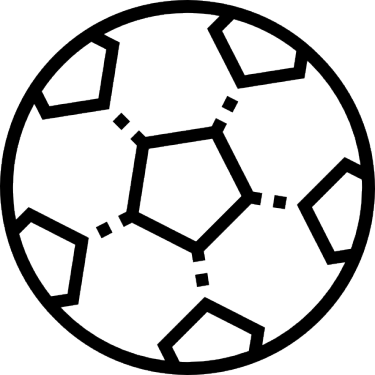

```
html
<!DOCTYPE html>
<html lang="fr">
    <head>
        <meta charset="UTF-8">
        <meta http-equiv="X-UA-Compatible" content="IE=edge">
        <meta name="viewport" content="width=device-width, initial-scale=1.0">
        <title>Portfolio</title>
        <link rel="stylesheet" href="css/style.css">
        <link rel="icon" type="image/png" sizes="16x16" href="https://img.icons8.com/material-rounded/50/000000/user-female-circle.png"/>
    </head>
    <body>
        
        <header>
            
            <h1 id="Home"></a>Thierry DAI - Développement</h1>
            
        </header>
        <main>     
            <nav>
                <a href="#Home">Home</a>
                <a href="#Experiences">Experiences</a>
                <a href="#End">End</a>
           </nav>
            <section id="premier">
                <h2>Compétences</h2>  
                        <div class="photo">
                        
                    
                        

                        

                          
                        </div>  
            </section>
            <div class="contact">
                <h2>Contact</h2>
                <ul>
                    <li>adresse: 9 Rue du général de larminat</li>
                    <li>téléphone: 07.83.63.27.58</li>
                    <li>email: thierrydail@hotmail.com </li>
                </ul>
            </div>
            <section>
                <h2>Logiciel</h2>
                <ul>
                    <li>Éclipse</li>
                    
                    <li>Visual Studio Code</li>
                </ul>
            </section>
            <section>
                <h2 id="Experiences">Éxperience</h2>
                <ul>
                    <li><a href="https://www.mjcclub.com/" target="_blank">Stage à l'accueil dans une association</a></li>
                </ul>
            </section>
            <section>
                <h2>Études</h2>
                <ul>
                    <li>Itic Paris 2021-2023 BTS SIO</li>
                    <li>Lycée Léon Blum 2018-2021 BAC STMG</li>
                    <li>Collège Louis Issaurat 2014-2018 BREVET</li>
                </ul>
            </section>
            <section>
                <h2>Loisirs</h2>
                <ul>
                    <li>Sport</li>
                    <li>Manga</li>
                    <li>Jeux vidéo</li>
                </ul>
            </section>
            
        </main>
        <footer>
            <h2>Mes réseaux sociaux</h2>
            <ul>
                <li><a href="https://www.youtube.com/channel/UC_8LZT6HQZmcHzGdMDCN3GA" target="blank_"></a>Youtube</li>
                <li><a href="https://twitter.com/linebooft" target="blank_"></a>Twitter</li>
                <li><a href="#"target="blank_"></a>Snap</li>
                <li><a href="https://github.com/thierrydai"target="blank_"></a>Github</li>
            </ul>
            <p id="End">&copy; - Thierry DAI </p>
        </footer>
    </body>
</html>
```
```
CSS
@import url('https://fonts.googleapis.com/css2?family=Montserrat&display=swap');
html{
    font-size: 62.5%; 
    scroll-behavior: smooth;
}
body{
    font: 1.6rem Montserrat sans-serif;
    margin: 0;
}
h1,h2,h3,h4,p,ol,ul,figure,dd{
    margin: 0;
    padding: 0;
    list-style-type: none;
}
h1,h2,h3,h4{
    font-weight: normal;
}
a{
    text-decoration: none;
}
/*Theme*/
:root{
    --color-primary: #000000;
    --color-secondary: #1ba7c066;
    --color-title: #1C1698 ;
}
body{
    background-color:var(--color-secondary);
}
header h1{
    color:var(--color-title);
    text-align: center;
    font-weight: bolder;
    font-size: 6rem;
    margin-bottom:6rem;
    background-color: var(--color-secondary);
    
}
h1 img{
    height:5rem;
    margin-top:2rem;
    margin-right:1rem;
}

main section{
    border-style:solid;
    border-radius: 2rem;
    border-color:var(--color-title);
    margin-bottom:5rem;
    margin-left:20%;
    margin-right:20%;
    background:url(https://img.freepik.com/vecteurs-libre/fond-degrade-effet-bokeh_23-2148360345.jpg?size=626&ext=jpg) no-repeat fixed center/cover;
    margin-top:1rem;  
}

main nav{
    font-size:2.5rem;
    border:solid ;
    position:fixed;
    word-spacing:0.5rem;
    border-color:var(--color-title);
    margin-left: 1%;
    border-radius:1rem;
    background-color:var(--color-secondary);
    
}

main nav a{
    display: inline-block;
    vertical-align: middle;
    margin: 0.5rem;
    cursor: pointer;
    
}
nav a:hover{
    background-color:red;
}
section h2{
    margin-top:2rem;
    margin-bottom:2rem;
    font-family: Montserrat;
    color:var(--color-title);
    text-align:center;
    font-size:4rem;
}
section h2 img{
    height:3rem;
    margin-right:1rem;
}
footer p{
    color: var(--color-title);
}

.premier{
    text-align: center;
    margin:1rem;
}
section div img{
    height: 5rem;
    width: 5rem;
    margin-left:2rem;
    margin-right:2rem;
    margin-bottom:2rem;
}
section ul li{
    text-align:center;
    list-style-type:none;
    font-size:3rem;
    margin-bottom:2rem;
}
#End{
    text-align:center;
    font-size:2rem;
}
.photo{
    text-align:center;
}
.contact h2{
    font-size: 4rem;
    margin-left:0;
    font-family: Montserrat;
    text-align:center;
    margin-bottom:0.5rem;

}
.contact ul li{
    font-size:1.5rem;
    margin-left: 1rem;
    text-align:center;
    margin-right: 1rem;
    margin-bottom: 1rem;
    color:var(--color-primary);
}
.contact{
    position:fixed;
    border:solid;
    border-radius:1rem;
    border-color:var(--color-title);
    margin-left:82%;
    margin-top:4%;
    background-color:var(--color-secondary);
}

footer{
    border:solid var(--color-title); 
    background-color:var(--color-secondary)
}
footer h2{
    margin:2rem;
    text-align:center;
    color:var(--color-title);
}
footer ul{
    display:flex;
    justify-content:center;
    margin-bottom:1rem;
}
footer li{
    display:flex;
    flex-wrap: wrap;
    align-items:center;
    margin-left:1rem;
    
}
footer img{
    width:4rem;
    height:4rem;
    margin-right:1rem;
    cursor:pointer;
    
}
```